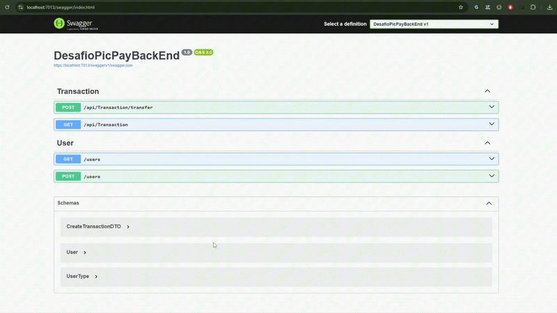
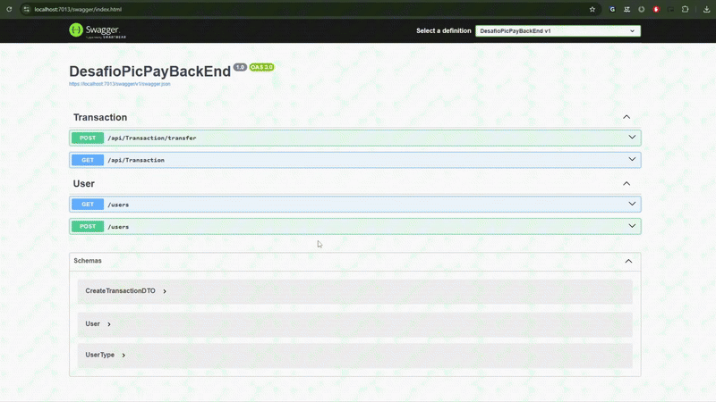

# PicPay Challenge - Sistema de Transferências Simplificado

[](https://dotnet.microsoft.com/)
[](LICENSE)
[]()

## Sobre o Projeto

Este projeto é uma implementação do [Desafio Técnico Backend do PicPay](https://github.com/PicPay/picpay-desafio-backend) utilizando **ASP.NET Core 8.0**, **C#**, **Entity Framework Core** e **SQLServer**. Foi desenvolvido com foco em demonstrar boas práticas de desenvolvimento backend, arquitetura limpa e código manutenível.

### Objetivos Alcançados

- API RESTful completa
- Arquitetura em camadas (Clean Architecture)
- Princípios SOLID aplicados
- Tratamento global de exceções
- Validação robusta com FluentValidation

## Tecnologias Utilizadas

*   **ASP.NET Core 8.0** - Framework web para APIs REST
*   **C# 11** - Linguagem de programação
*   **Entity Framework Core** - ORM para acesso ao banco de dados
*   **SQLServer** - Banco de dados (fácil para desenvolvimento e testes)
*   **Swagger/OpenAPI** - Documentação automática da API
*   **HttpClient** - Para integração com serviços externos
*   **FluentValidation** - Validação de dados

## Arquitetura do Projeto

O projeto segue os princípios da Clean Architecture, promovendo a separação de responsabilidades e a manutenibilidade do código:

```
┌─────────────────────────────────────┐
│              API Layer              │
│         (Controllers, DTOs)         │
├─────────────────────────────────────┤
│           Application Layer         │
│      (Services, Validators)         │
├─────────────────────────────────────┤
│            Domain Layer             │
│       (Entities, Exceptions)       │
├─────────────────────────────────────┤
│         Infrastructure Layer        │
│    (Data, External Services)       │
└─────────────────────────────────────┘
```

### Principais Componentes

*   **Controllers**: Responsáveis por receber requisições HTTP e orquestrar as operações, delegando a lógica de negócio para a camada de serviço.
*   **Services**: Contêm a lógica de negócio principal, orquestrando as operações e interagindo com outras camadas.
*   **Models/Entities**: Entidades que representam os dados (User, Transaction).
*   **Data/DbContext**: Configuração do Entity Framework e relacionamentos.
*   **Validators**: Classes para validação de DTOs usando FluentValidation.
*   **External Services**: Abstrações para comunicação com serviços externos (autorização, notificação).
*   **Middleware**: Componentes para tratamento global de exceções e outras funcionalidades transversais.

## Modelo de Dados

### User (Usuário)

*   `Id`: Identificador único
*   `FullName`: Nome completo
*   `CPF`: CPF ou CNPJ (único)
*   `Email`: Endereço de e-mail (único)
*   `Password`: Senha (armazenada como hash)
*   `Balance`: Saldo da carteira
*   `UserType`: Tipo (Common = 1, Merchant = 2)

### Transaction (Transação)

*   `Id`: Identificador único
*   `PayerId`: ID do usuário que envia
*   `PayeeId`: ID do usuário que recebe
*   `Amount`: Valor da transferência
*   `CreatedAt/ProcessedAt`: Timestamps

## Funcionalidades Implementadas

### Regras de Negócio Atendidas

1.  **Validação de Dados Únicos**: CPF/CNPJ e e-mail únicos no sistema.
2.  **Tipos de Usuário**: Diferenciação entre usuários comuns e lojistas.
3.  **Restrição de Lojistas**: Lojistas não podem enviar transferências.
4.  **Validação de Saldo**: Verificação de saldo suficiente antes da transferência.
5.  **Autorização Externa**: Consulta ao serviço mock de autorização.
6.  **Transações Atômicas**: Operações de transferência são transacionais (garantia de rollback).
7.  **Notificações**: Envio de notificação via serviço externo (assíncrono e resiliente).
8.  **API RESTful**: Endpoints seguindo padrões REST.
9.  **Tratamento Global de Exceções**: Middleware para padronizar respostas de erro.
10. **Validação Robusta**: Uso de FluentValidation para validação de entrada.

### Endpoints da API

#### Usuários

*   `POST /api/users` - Criar novo usuário
*   `GET /api/users` - Listar todos os usuários

#### Transações

*   `POST /api/transactions/transfer` - Realizar uma transferência entre usuários
*   `GET /api/transactions` - Historico de todas transferência entre usuários

## Como Executar

### Pré-requisitos

*   [.NET 8.0 SDK](https://dotnet.microsoft.com/download)
*   Git

### Passos para Execução

1.  **Clone o repositório**
    
    ```shell
    git clone https://github.com/cnthigu/DesafioPicPay-backend.git
    cd DesafioPicPay-backend
    ```
    
2.  **Executar Localmente**
    
    *   **Restaurar dependências**
        
        ```shell
        dotnet restore
        ```
        
    *   **Aplicar migrações do banco**
        
        Certifique-se de ter um SQL Server rodando localmente e atualize a string de conexão em `appsettings.Development.json` se necessário.
        
        ```shell
        dotnet ef database update
        ```
        
    *   **Executar a aplicação**
        
        ```shell
        dotnet run
        ```
        
3.  **Acessar a documentação**
    
    *   Swagger UI: `http://localhost:5000/swagger`
    *   API Base URL: `http://localhost:5000/api`

## Exemplos de Uso

### Criar Usuário Comum

```shell
curl -X POST http://localhost:5000/api/users \
  -H "Content-Type: application/json" \
  -d '{
    "fullName": "Higor Carniato",
    "cpf": "12345678900",
    "email": "higor@example.com",
    "password": "senha123",
    "balance": 500.00,
    "type": 1
  }'
```

### Realizar Transferência

```shell
curl -X POST http://localhost:5000/api/transactions/transfer \
  -H "Content-Type: application/json" \
  -d '{
  "payerId": 1,
  "payeeId": 2,
  "amount": 100.00
  }'
```

## Desenvolvedor

Este projeto foi desenvolvido como parte de um estudo de caso para demonstrar conhecimentos em:

*   Desenvolvimento de APIs REST com ASP.NET Core
*   Arquitetura em camadas e separação de responsabilidades (Clean Architecture, SOLID)
*   Entity Framework Core e migrações
*   Implementação de regras de negócio complexas
*   Integração com serviços externos e resiliência
*   Tratamento de erros e validações robustas
*   Documentação de APIs com Swagger

## Essa é uma primeira versão, muita coisa precisa se melhorada e implementada.

## Sobre.

API RESTful em ASP.NET Core para fins educacionais, simulando transações financeiras entre usuários — inspirado no desafio do PicPay.

*   [C# 100.0%]()

## Demonstração

### Criando usuário via Swagger


### Realizando transferência entre usuários
